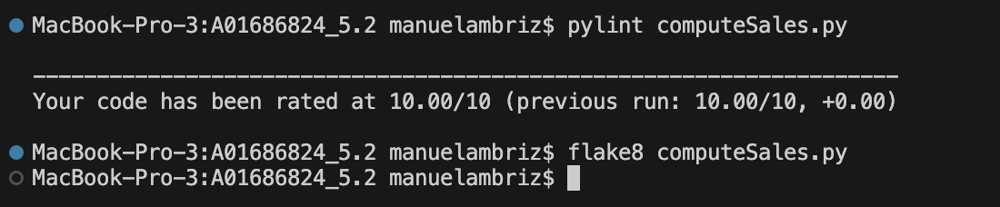

# Compute Sales Program

## Description
This program, `computeSales.py`, calculates the total cost of sales based on a product price catalogue and a sales record. It matches products from the sales record to their prices in the catalogue, computes the total cost for each sale, and sums them up. The results, including the total cost and execution time, are displayed on the console and saved to `SalesResults.txt`.

## Prerequisites
- Python 3.x installed.
- No external libraries required (uses standard `sys`, `json`, `time`).
- `flake8` and `pylint` for code quality checks.

## Usage
Run the program from the command line by providing the path to the price catalogue JSON file and the sales record JSON file as arguments:

```bash
python computeSales.py priceCatalogue.json salesRecord.json
```

## Programa 1. Análisis de Errores de Pylint – PEP 8
The code adheres to PEP 8 standards and passes Pylint checks with a score of 10.00/10.



## Programa 1. Análisis de Errores de Flake
The code has been checked with Flake8 and contains no errors.


## Programa 3. Correcta Ejecución de Casos de Prueba
The following test cases (TC1, TC2, TC3) demonstrate the correct execution of the program with different datasets.

### Test Case 1 (TC1)
**Description:** Basic test case with a small dataset.
**Command:**
```bash
python computeSales.py TC1.ProductList.json TC1.Sales.json
```
**Expected Output:**
```
Sales Computation Results
-------------------------
Total Sales Cost: $2,481.86
Time Elapsed: 0.000364 seconds
```

### Test Case 2 (TC2)
**Description:** Larger dataset to test performance and correctness with more entries.
**Command:**
```bash
python computeSales.py TC1.ProductList.json TC2.Sales.json
```
**Expected Output:**
```
Sales Computation Results
-------------------------
Total Sales Cost: $166,568.23
Time Elapsed: 0.000463 seconds
```

### Test Case 3 (TC3)
**Description:** Dataset containing invalid items not present in the catalogue ("Elotes", "Frijoles"). The program should handle these gracefully by printing warnings and continuing the calculation for valid items.
**Command:**
```bash
python computeSales.py TC1.ProductList.json TC3.Sales.json
```
**Expected Console Output (including warnings):**
```
Warning: Product 'Elotes' not found in catalogue.
Warning: Product 'Frijoles' not found in catalogue.
Sales Computation Results
-------------------------
Total Sales Cost: $165,235.37
Time Elapsed: 0.001133 seconds
```

## Output File
Every execution updates the `SalesResults.txt` file with the latest results.
